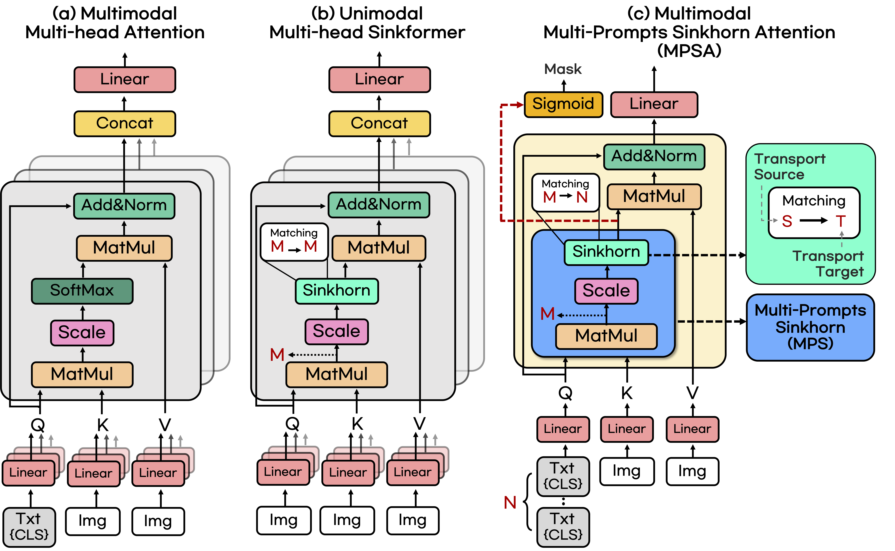

[](https://paperswithcode.com/sota/zero-shot-semantic-segmentation-on-pascal-voc?p=otseg-multi-prompt-sinkhorn-attention-for)<br>
[](https://paperswithcode.com/sota/zero-shot-semantic-segmentation-on-coco-stuff?p=otseg-multi-prompt-sinkhorn-attention-for)<br>


# OTSeg: Multi-prompt Sinkhorn Attention for Zero-Shot Semantic Segmentation (ECCV 2024)

Authors: Kwanyoung Kim*, Yujin Oh*, Jong Chul Ye   
*Equal contribution

[](https://cubeyoung.github.io/OTSeg_project/)
[](https://arxiv.org/pdf/2403.14183)

---

> **Abstract:** *The recent success of CLIP has demonstrated promising results in zero-shot semantic segmentation by transferring muiltimodal knowledge to pixel-level classification. However, leveraging pre-trained CLIP knowledge to closely align text embeddings with pixel embeddings still has limitations in existing approaches. To address this issue, we propose OTSeg, a novel multimodal attention mechanism aimed at enhancing the potential of multiple text prompts for matching associated pixel embeddings. We first propose Multi-Prompts Sinkhorn (MPS) based on the Optimal Transport (OT) algorithm, which leads multiple text prompts to selectively focus on various semantic features within image pixels. Moreover, inspired by the success of Sinkformers in unimodal settings, we introduce the extension of MPS, called Multi-Prompts Sinkhorn Attention (MPSA) , which effectively replaces cross-attention mechanisms within Transformer framework in multimodal settings. Through extensive experiments, we demonstrate that OTSeg achieves state-of-the-art (SOTA) performance with significant gains on Zero-Shot Semantic Segmentation (ZS3) tasks across three benchmark datasets.* 
>
> <p align="center">
> 
> </p>

## News
* [2024.07.05] Our official Code Release
* [2024.07.04] Our paper is accepted on ECCV2024. 

## Environment:

- Install pytorch

 `conda install pytorch==1.10.1 torchvision==0.11.2 torchaudio=0.10.1 cudatoolkit=10.2 -c pytorch`

- Install required packages.

 `pip install -r requirements.txt`

## Downloading and preprocessing Dataset:
According to MMseg: https://github.com/open-mmlab/mmsegmentation/blob/master/docs/en/dataset_prepare.md

## Preparing Pretrained CLIP model:
Download the pretrained model here: Path/to/pretrained/ViT-B-16.pt
https://openaipublic.azureedge.net/clip/models/5806e77cd80f8b59890b7e101eabd078d9fb84e6937f9e85e4ecb61988df416f/ViT-B-16.pt

## Training (Inductive):
 ```shell
 bash dist_train.sh configs/coco/vpt_seg_zero_vit-b_512x512_80k_12_100_multi.py Path/to/coco/induct
 bash dist_train.sh configs/context/vpt_context_vpt.py Path/to/context/induct
 bash dist_train.sh configs/voc12/vpt_seg_zero_vit-b_512x512_20k_12_10.py Path/to/voc12/induct
 ```

## Training (Transductive):
 ```shell
 bash dist_train.sh ./configs/coco/vpt_seg_zero_vit-b_512x512_40k_12_100_multi_st.py Path/to/coco/trans --load-from=Path/to/coco/induct/iter_40000.pth
 bash dist_train.sh ./configs/context/vpt_context_st_vpt.py Path/to/context/trans --load-from=Path/to/context/induct/induct/iter_20000.pth
 bash dist_train.sh ./configs/voc12/vpt_seg_zero_vit-b_512x512_10k_12_10_st.py Path/to/voc12/trans --load-from=Path/to/voc12/induct/iter_10000.pth
 ```

## Training (Fully supervised):
 ```shell
 bash dist_train.sh configs/coco/vpt_seg_fully_vit-b_512x512_80k_12_100_multi.py Path/to/coco/full
 bash dist_train.sh configs/context/vpt_context_fully.py Path/to/context/full
 bash dist_train.sh configs/voc12/vpt_seg_fully_vit-b_512x512_20k_12_10.py Path/to/voc12/full
 ```

## Pretrained models:

|     Dataset     |   Setting    |    Model Zoo   |
| :-------------: | :---------:  | :----------------------------------------------------------: |
| PASCAL VOC 2012 |  Inductive   |  [[Google Drive](https://drive.google.com/file/d/1UjyrFxQ0TTSDiQYse5MxAvHVyhJpqgMA/view?usp=drive_link)] |
| PASCAL VOC 2012 | Transductive |  [[Google Drive](https://drive.google.com/file/d/1SPXHxDl7znsOqUi9APnl3qx9BvmUbfny/view?usp=drive_link)] |
| PASCAL VOC 2012 |    Fully     |  [[Google Drive](https://drive.google.com/file/d/1SPXHxDl7znsOqUi9APnl3qx9BvmUbfny/view?usp=drive_link)] |
| PASCAL CONTEXT  |  Inductive   |  [[Google Drive](https://drive.google.com/file/d/1ZtNRtUR4fnl1b-oTc44v5HhmXhyx_w4-/view?usp=drive_link)] |
| PASCAL CONTEXT  | Transductive |  [[Google Drive](https://drive.google.com/file/d/1AZspmBiyjeOzMg5Aq165CcPz3ZLA-_BS/view?usp=drive_link)] |
| PASCAL CONTEXT  |    Fully     |  [[Google Drive](https://drive.google.com/file/d/1wTAC7uACPV66VEtlh0qzRMXmNN9mk5gU/view?usp=drive_link)] |
| COCO Stuff 164K |  Inductive   |  [[Google Drive](https://drive.google.com/file/d/11t3cnRicO9esJrvRjx5O4jL_1v1FDPa8/view?usp=drive_link)] |
| COCO Stuff 164K | Transductive |  [[Google Drive](https://drive.google.com/file/d/1BhxxmuW0R7Pyt2Ty4ERzg9lkKbZQmUY0/view?usp=drive_link)] |
| COCO Stuff 164K |    Fully     |  [[Google Drive](https://drive.google.com/file/d/1j4dDVz4hWUum68AdQC2n5FDkrstY-zhI/view?usp=drive_link)] |

## Inference:
 `python test.py ./path/to/config ./path/to/model.pth --eval=mIoU`

## Cross Dataset Inference:
```shell
CUDA_VISIBLE_DEVICES="0" python test.py ./configs/cross_dataset/coco-to-ade.py Path/to/coco/trans/iter_40000.pth --eval=mIoU
CUDA_VISIBLE_DEVICES="0" python test.py ./configs/cross_dataset/coco-to-context.py Path/to/coco/trans/iter_40000.pth --eval=mIoU
CUDA_VISIBLE_DEVICES="0" python test.py ./configs/cross_dataset/coco-to-voc.py Path/to/coco/trans/iter_40000.pth --eval=mIoU
CUDA_VISIBLE_DEVICES="0" python test.py ./configs/cross_dataset/context-to-coco.py Path/to/context/trans/iter_20000.pth --eval=mIoU
CUDA_VISIBLE_DEVICES="0" python test.py ./configs/cross_dataset/context-to-voc.py Path/to/context/trans/iter_20000.pth --eval=mIoU
```

## Acknowledgement:
 - CLIP:  https://github.com/openai/CLIP
 - Visual Prompt Tuning: https://github.com/KMnP/vpt
 - ZegOT: https://arxiv.org/abs/2301.12171
 - ZegCLIP: https://github.com/ZiqinZhou66/ZegCLIP
 - PLOT: https://github.com/CHENGY12/PLOT
 - Sinkformer: https://github.com/michaelsdr/sinkformers
 
## Citation:
```
@misc{kim2024otsegmultipromptsinkhornattention,
      title={OTSeg: Multi-prompt Sinkhorn Attention for Zero-Shot Semantic Segmentation}, 
      author={Kwanyoung Kim and Yujin Oh and Jong Chul Ye},
      year={2024},
      eprint={2403.14183},
      archivePrefix={arXiv},
      primaryClass={cs.CV},
      url={https://arxiv.org/abs/2403.14183}, 
}
```
